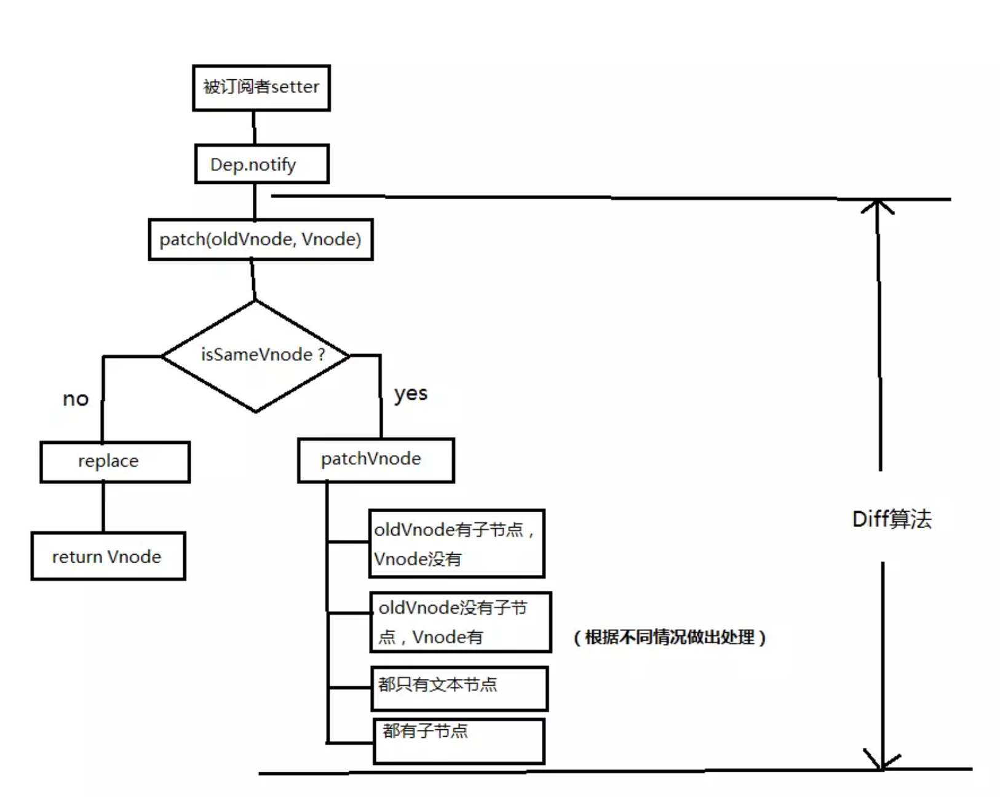

#### 原理

> [参考资料](<https://juejin.im/post/5a734b6cf265da4e70719386>)

##### 设计模式

- 观察者模式

##### 实现方法

1. InitData
    1. 将vue实例的_data数据代理到vm上
    2. 通过执行Observer将所有的data变成可观察的(对data的每个属性添加setter,getter)

2. Observer 
    将data变成可观察

3. Dep 
    作为Observer和Watcher的通信纽带，相当于报亭

    Dep.target 指向 Watcher

4. Watcher 相当于邮递员，报亭通知有新消息之后，负责把消息传送给订阅报纸的人, 
    `一个watcher只为一个人服务，但是可以给这个人传送多个报社更新的消息`

    1. 解析指令、模板中的表达式
    2. 生成Watcher存储与Dep中

