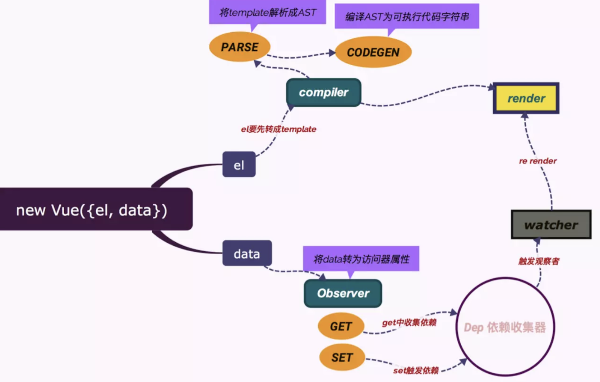

### Vue 

> 参考资料 

#### 结构梳理

#### 

#### 实例初始化

整个初始化过程重中之重就是把Model和View建立关联 `VM`

1. 通过Observer给data中的每一个key添加 `__ob__`，将数据变成可观察，并实例化 Dep
2. 收集Watcher，调用get() -> 触发 getter -> 把Dep.target设置为当前Watcher
   - 模板绑定的数据
   - vue-option中watch选项

[Vue.js的响应式系统原理](<https://juejin.im/post/5b82b174518825431079d473>)

